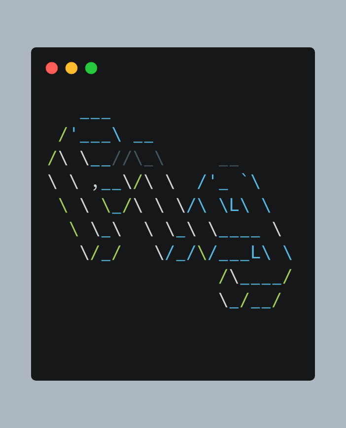

# fig 

<div align="center">
    
</div>


Figlet ASCII art text generator with PNG export capabilities.

## Minimum Requirements

* [Python 3.12+](https://www.python.org/downloads/release/python-3120/)
* [uv](https://docs.astral.sh/uv/)

## Recommended Requirements

* [mise](https://mise.jdx.dev/getting-started.html)

## Quickstart

```bash
# clone repo
git clone git@github.com:pythoninthegrass/fig.git
cd fig

# symlink to somewhere on path
ln -s $(pwd)/fig.py ~/.local/bin/fig

# run script
fig                                     # Run help (also accepts -h, --help)
fig preview slant                       # Preview slant font with default text
fig preview slant 'Hello'               # Preview slant font with custom text
fig generate slant 'Hello' out.png      # Generate PNG image
fig list                                # Show available fonts
```

## Development

Clone the repo per [Quickstart](#quickstart), then do the following:

```bash
# setup virtual environment (venv)
uv venv --python ">=3.12,<3.13"
uv pip install -r pyproject.toml --all-extras

# source venv
source .venv/bin/activate

# poke around

# run tests
uv run pytest -v

# run pre-commit hooks
uv run pre-commit run --all-files

# exit venv
deactivate
```

## TODO

Outstanding tasks live in [TODO.md](TODO.md)

## Further Reading

* [FIGlet](http://www.figlet.org/)
* [pyfiglet](https://github.com/pwaller/pyfiglet)
* [pictext](https://pictex.readthedocs.io/)
